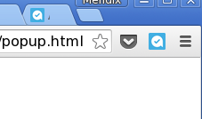

# Introduction

I am hooked to Pocket chromium extension and I use it for everything, to send stuff to read later, to watch later, to buy later, to DO later...And it's getting crowded!

It's usually better to do thing right away, but multitasking is bad! Therefore a button to add the page to your favorite Task tool.

# Usage

(todo)

# Test

(wip) 
* from popup.html, comment out the popup.js
* uncomment the line popus.local.js
* puts your api key in popup.local.js
* load popup.html in chrome

# Todos

[] add usage in readme
[] remplace spinner by a nicer one
[] the add url button should rather create a document in azendoo on the task or workspace instead of just pasting it in the body

# thanks

Big thanks to google chrome resources, chromium team, pocket and azendoo